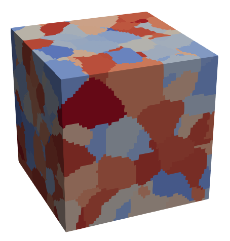
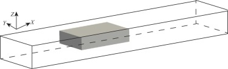
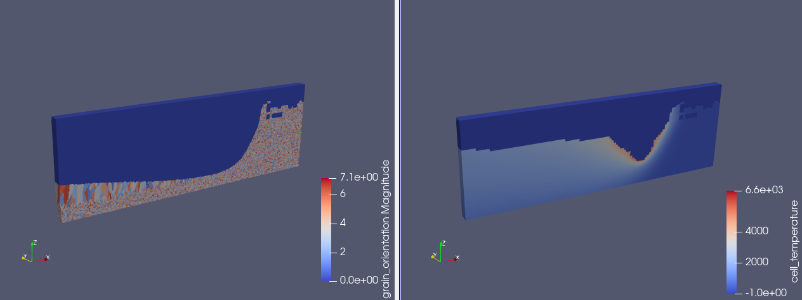
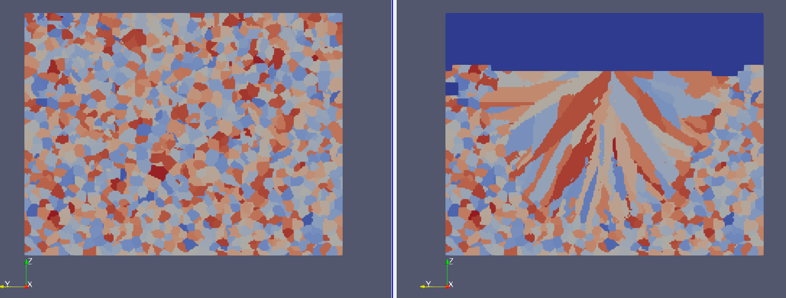

# AMCA3D

# AMCA3D

AMCA3D (3D Cellular Automata method for Additive Manufacturing) is a parallel C++ program designed for modeling mesoscale grain structure evolution during the additive manufacturing process.

# Requirement

- MPICH2
- YAML (ver. 0.3.0)
- BOOST (ver. 1.64.0)
- CMAKE
- gcc & g++
- git (Optional)
- Paraview (for visualization)

**It is highly recommended to install the given version of YAML and BOOST. Although it is not the newest, we did not do any compatibility test for the newest version.**

# Installation

AMCA3D should be installed on a Unix-like system. If you are using Windows 10 or 11, WSL (Windows Subsystem for Linux) is good. Check [here](https://docs.microsoft.com/zh-cn/windows/wsl/install) for the installation of WSL.

## Install gcc and so on

Using the following command to install a modern GCC compiler. If you already have one, go straight to the MPI setup.

```bash
sudo apt install gcc g++ cmake git build-essential unzip
```

## Install MPICH

```bash
sudo apt install mpich
```

## Install BOOST

Install `BOOST` to the default path, name `$HOME/BOOST`. Or edit the `prefix` option to the preferred path where you want to install.

```bash
# download and unzip
cd ~
wget -c https://boostorg.jfrog.io/artifactory/main/release/1.64.0/source/boost_1_64_0.tar.gz

tar -xf boost_1_64_0.tar.gz
cd boost_1_64_0

# install
./bootstrap.sh --prefix=$HOME/BOOST --with-libraries=signals,\
regex,filesystem,system,mpi,serialization,thread,program_options,exception
./b2 -j 4 install
```

Now the `Boost` has been installed***.***

## Install YAML

Install `BOOST` to the default path, name `$HOME/YAML`. Or edit the `prefix` option to the preferred path where you want to install.

```bash
# download and unzip
cd ~
wget -c https://github.com/jbeder/yaml-cpp/archive/refs/tags/release-0.3.0.tar.gz
tar -xf release-0.3.0.tar.gz
cd yaml-cpp-release-0.3.0/
mkdir build
cd build
# install
cmake -DCMAKE_CXX_COMPILER=mpicxx -DCMAKE_CXX_FLAGS=-std=c++11 \
-DCMAKE_CC_COMPILER=mpicc -DCMAKE_INSTALL_PREFIX=$HOME/YAML ..
make
make install
```

Now the `YAML` has been installed***.***

## Install AMCA3D

## Step1

```bash
# download
cd ~
git clone https://github.com/YPLianGroup/AMCA3D.git
cd AMCA3D
mkdir build
cd build
cp ../configure.sh .
```
Or you can click here ([Github](https://github.com/YPLianGroup/AMCA3D) & [LianGroup](http://www.lianyanpinggroup.com/819.html)) to download the code.
## Step2

If the `BOOST` and `YAML` have been installed to the default path, skip this step and go to Step 3 directly. 

Then set the directories for both `Boost` and `YAML` by editing the first 3 lines of the `configure.sh` script via notepad or vim. Let’s see the first 3 lines of `configure.sh`:

```bash
# set "boost_root" and "yaml_root" to the your path of BOOST and YAML
boost_root= {YOUR ***BOOST_ROOT_DIR***}
yaml_root= {YOUR ***YAML_ROOT_DIR***}
```

## Step3

Execute this for an executable file `AMCA3D`:

```bash
./configure.sh
make
```

# ****Tutorial & examples****

## Nucleation

This example shows the nucleation in a uniform temperature field with a consistent cooling rate. The nucleation site is randomly distributed in the domain and its critical undercooling follows a Gaussian distribution.

To run this example, go to the example folder, name `\CA_ROOT\example\nucleation`, then execute:

```bash
./nucleation.sh
```

The script `nucleation.sh` looks like

```bash
cp ../../build/AMCA3D ./
mpirun -np 4 AMCA3D -i Inputfile.i -o run.log
```

The first line is to copy the `AMCA3D` to the working path, and the second line is to run the simulation. `mpirun -np <number of processes> [*program-name]*` is a commend to run the program (`AMCA3D` here) as multiple processes. `-i [inputfile-name] -o [outputfile-name]` is using to specify the input and output file name. The input file tells the program how to set up the simulation, and the output file gives the detail of the simulation, including the review of the simulation, process monitor, or some error information.

Now the program is running, a `\result` folder is created and the frames of simulation is saved in this folder. Open the `\CA_ROOT\example\nucleation\result\Grain.pvd` to visualize results by a third-party open-source program `paraview`. Once the simulation is done, the final result is saved to `finalGrain.vtk`. If everything goes well, you can see the following result in `paraview`.



The color shows the grain structures.

Currently, the first try is done, and we can modify the input file to set up our own simulation. so let’s take a look at the input files first. At first, the input file is written in a `YAML` format. It is OK if you do not know `YAML` before because it is very human-friendly, and we do not need to write input files from scratch.

The most important parameter is listed in the `realms` section. It looks like:

```yaml
realms:
  - name: realm1
    type: cellular_automata
    dimension: 3

    domain:
      type: cubic
      original_point: [0,0,0]
      lateral_sizes: [0.03, 0.03, 0.03]

    discretization:
      cell_size: 0.0005

    nucleation_rules:
      - surface:
          type: Gaussian
          site_density: 0.0
          mean: 2
          standard_deviation: 0.5

      - bulk:
          type: Gaussian
          site_density: 10e6
          mean: 3
          standard_deviation: 1

    problem_physics:
        type: RappazGandin
        initial_temperature: -0.2
        melting_temperature: 0.0
        t_dot: -20
        a1: -0.544e-4 
        a2: 2.03e-4
        a3: 0.0
```

The `domain` and `discretization` set the location and size of the domain.

`nucleation_rules` controls the nucleation density and the critical undercooling of the site. Nucleation may occur both at the surface and in the bulk of the liquid volume. Taking the bulk nucleation as an example, we use $\rho$ to denote the nucleation site density for bulk liquid, and V represents the total volume of the simulation domain. Then the total number of bulk nucleation sites in the bulk is given by $N=\rho V$. `mean` and `standard deviation` are the parameters for the critical undercooling $\Delta T_c$ of the nucleation site. Once the undercooling is greater than the $\Delta T_c$, nucleation occurs.

`problem_physics` controls the nucleation condition (`initial_temperature`, `t_dot`: cooling rate) and the the property of cells (`melting_temperature`, `a1 a2 a3`: parameters for a polynomial $v(\Delta T)=a_1\Delta T+a_2\Delta T^2+a_3\Delta T^3$, which is obtain by dendrite tip growth kinetics). 

Now, let's try to edit these parameters for your second simulation. Notice, `AMCA3D` is dimensionless, so the unit must be unified.

## Additive manufacturing

Now let’s try to apply this program to an additive manufacturing process. A `.txt` format temperature field is needed, which can be obtained by thermal process modeling with a coarse mesh. The program read the temperature results and interpolates to fine CA mesh. Typically, the two modeling domains can be seen as follows.



The outline domain is for thermal modeling with a coarse mesh, and the solid domain is for CA with a fine mesh.

  Here are 2 powder bed fusion (PBF) examples in the `\PBF_AM` folder. Let’s try `PBF_x` first.

## PBF_x

Go to the folder `\example\PBF_x`, then execute:

```bash
./PBF_x.sh
```

The script unzip `PBF_x.zip` for the temperature results file and run the simulation. If everything goes well, you can see the following image in your [Paraview](https://www.paraview.org/download/):



Left: grain growth evolution. Right: interpolated temperature field. The deep blue on Left shows the void cells and liquid cells. The deep blue on Right only shows the void region. Only a slice of temperature results is given due to reducing the file size.

Let’s have a look at the input file. At first, two solvers should be selected in the `solvers` section:

```yaml
solvers:
   - cellular_automata         # activate the cellular automata method
   - finite_element_method     # activate the finite element method to calculate temperature from coarse mesh to fine mesh
```

Second, a new section `transfers` should be defined. This section controls the algorithm to map CA mesh to FEM mesh. The initial settings are OK for simulation. The most important keyword is `void_temperature` here. The `void_temperature` defines a cutoff temperature for the void. All cells are deactivated in simulation if their temperature is less than `void_temperature`, and are reactivated again if their temperature is greater than `void_temperature`. Through this, the void between powder particles can be simulated.

Next, a new `realm` for finite_element should be defined. It look like:

```yaml
- name: realm0
    type: finite_element
    dimension: 3
    mesh: ./PBF_x.txt

    solution_options:
       name: my_options

       options:
         - load_data_from_file:
             theta: theta
             for_whole_time: yes
             length_scale: 10.0
             time_scale: 1.0
             lines_for_title: 4
             lines_for_subtitle: 5
             x_offset: 0
             z_offset: 0

    output:
      output_data_base_name: ./Results/FEM
      output_frequency: 200000
      output_time_interval: 0.0002
      output_variables:
        - temperature
```

`mesh` specifies the path of temperature results. The `options` section is used to make sure the temperature field is well set up. For example, `length_scale` and `time_scale` are used to unify the unit of length and time between CA and thermal modeling. `offset` is used to adjust the location of the thermal field. `lines_for_title` and `lines_for_subtitle` corresponding to the file’s title.

Now we know how to simulate the grain evolution under a given temperature result, then here is a simple example to illustrate the file format that the program supports. The temperature result file may look like this:

```
Title: 
Temperature file example
2022/04/13
End of title                                                                         

Subtitle (the second line)
No. step   No. step    time   time   x0    x1   y0   y1    z0   z1
   1          1         0       0     0     1    0    1     0    1
x  y  z  tn
0  0  0  293
1  0  0  293
0  1  0  293
1  1  0  293
0  0  1  293
1  0  1  293
0  1  1  293
1  1  1  293

Subtitle (the second line)
No. step   No. step    time   time   x0    x1   y0   y1    z0   z1
   2          2         0.1    0.1     0     1    0    1     0    1
x  y  z  tn
0  0  0  300
1  0  0  300
0  1  0  300
1  1  0  300
0  0  1  300
1  0  1  300
0  1  1  300
1  1  1  300
```

As we can see, the example file consists of three parts: title, subtitle, and data. The title part consists of 4 lines, the subtitle consists of 5 lines and the data part consists of 8 lines. The title part is optional but the subtitle part and data parts are necessary for the program. The subtitle part indicates the step, time, and domain size information. The number of cells in the `X Y Z` direction can be gotten by `x1-x0 y1-y0 z1-z0`, respectively, and the total number of cells is $N_{cell}=(x1-x0)(y1-y0)(z1-z0)$. The data part gives the (X,Y,Z) coordinates and temperature information for each point. The number of lines in data part $N_{data}$ must match the number of cells in the dataset. Here, $N_{cell}=1, N_{data}=8$ (a hex cell has 8 points). **Notice that only structured hex mesh is supported now.** So there is a relation $N_{data}=(x1-x0+2)(y1-y0+2)(z1-z0+2)$. Finally, the point data should be sort in the order of (X,Y,Z). You can modify the `lines_for_title` and `lines_for_subtitle` in the input file to adapt your temperature file, but the  `lines_for_subtitle` must be great than 4, and the 4th line of the subtitle should be written in the given format.

## PBF_y

Now `PBF_x` case shows how to simulate the grain evolution with a given file, but if we have a series of temperature file, this is very common for additive manufacturing because of the line-by-line and layer-by layer process. This example shows how to initialize the grain structure by existing simulation results. 

At first, go to the folder `\example\PBF_y`, then execute:

```bash
./PBF_y.sh
```

The script run a nucleation case first, and the nucleation result are saved to `\PBF_y\PreRun`. Then,  `PBF_x.zip` is unzipped and a second case that a laser is melting on a powder bed with the grain structure initialized by the nucleation result. is conducted. If everything goes well, you can see the following image in your [Paraview](https://www.paraview.org/download/):



(Left) nucleation result and (Right) PBF_y result.

As we can see, the nucleation result has been used to initialize the grain structures. This is so-called **restart strategy**, which is illustrate in [[1]](https://linkinghub.elsevier.com/retrieve/pii/S0264127520309461). This function is implemented by reading the previous result file (default: grainInfo.txt). A result file must be specified in `realm: solution_options: options: output_microstructure_information \ load_microstructure_information` in the inputfile, such as:

```
- output_microstructure_information:
             file_name: grainInfo.txt
             output_seeds: yes
         - load_microstructure_information:
             file_name: ./PreRun/grainInfo.txt 
```

Notice: To use the **restart strategy**, make sure the `domain size` and the `number of processes` are consistent in the series of simulations. Otherwise, error occurs.

# ****Contact and Citatioin****

If you conduct your research based on our open-source code AMCA3D, **please cite the following reference in your upcoming papers**, and it will be better to respect our work by making a statement in Acknowledgement (e.g., “**We are grateful to Prof. [Yanping Lian group](http://www.lianyanpinggroup.com/en/) for sharing their codebase of AMCA3D**”.). Many thanks in advance!

If you have any questions regarding the codebase, please feel free to contact us at [yanping.lian@bit.edu.cn](mailto:yanping.lian@bit.edu.cn).

Hope you enjoy the AMCA3D.

[1] F.Y. Xiong, Z.T. Gan, J.W. Chen, Y.P. Lian*. Evaluate the effect of melt pool convection on grain structure in selective laser melted IN625 alloy using experimentally validated process-structure modeling. *Journal of Materials Processing Technology*, 303:117538,2022.

[2] F.Y. Xiong, C.Y. Huang, O. L. Kafka, Y. P. Lian*, W.T. Yan, M.J. Chen, D.N. Fang. Grain growth prediction in selective electron beam melting of Ti-6Al-4V with a cellular automaton method. *Materials & Design*, 199:109410, 2021.

[3] L.C Geng, B. Zhang, Y.P Lian*, R.X. Gao, D.N. Fang*. An image-based multi-level hp FCM for predicting elastoplastic behavior of imperfect lattice structure by SLM. *Computational Mechanics*, 2022.

[4] D. Kats, Z. Wang, Z. Gan, W.K. Liu, G. J. Wagner, Y.P. Lian*. A physics-informed machine learning method for predicting grain structure characteristics in directed energy deposition. *Computational Materials Science*, 202:110958, 2021.

[5] **廉艳平***，王潘丁，高杰，等. 金属增材制造若干关键力学问题研究进展. 力学进展，51(3):648-701, 2021. (Y.P. Lian*, P.D. Wang, J. Gao, et al. Fundamental mechanics problems in metal additive manufacturing: A state-of-art review. Advances in Mechanics, 51(3): 648-701, 2021).

[6] 黄辰阳，陈嘉伟，朱言言，**廉艳平***. 激光定向能量沉积的粉末尺度多物理场数值模拟. 力学学报，53(12):3240-3251, 2021. (C.Y Huang, J.W. Chen, Y.Y. Zhu, Y.P. Lian*. Powder scale multiphysics numerical modeling of laser directed energy deposition, Chinese Journal of Theoretical and Applied Mechanics, 53(12): 3240-3251, 2021)

[7] 陈嘉伟，熊飞宇，黄辰阳，**廉艳平***. 金属增材制造数值模拟. 中国科学: 物理学 力学 天文学, 50 (9): 09007, 2020. (J.W. Chen, F.Y. Xiong, C.Y. Huang, Y.P. Lian. Numerical simulation on metal additive manufacturing. Science Sinica Physica, Mechanica & Astronomica, 50 (9): 09007, 2020.)

[8] Y.P. Lian*, Z. Gan, C. Yu, D. Kats, W. K. Liu, G. J. Wagner. A cellular automaton finite volume method for microstructure evolution during additive manufacturing. Materials & Design, 169: 107672, 2019.

[9] Y.P. Lian, S. Lin, W.T. Yan, W.K. Liu, G.J. Wagner*. A parallelized three-dimensional cellular automaton model for grain growth during additive manufacturing. Computational Mechanics, 61:543-559, 2018.

[10] Z. Gan#, Y.P. Lian#, S. Lin, K. Jones, W.K. Liu*, G. Wagner*. Benchmark study of thermal behavior, surface topography, and dendritic microstructure in selective laser melting of Inconel 625. *Integrating Materials and Manufacturing Innovation*, 8: 178-193, 2019.

[11] W.T. Yan#, Y.P. Lian#, C. Yu, O. Kafka, Z. L. Liu, W.K. Liu, G. Wagner*. An integrated process-structure-property modeling framework for additive manufacturing. *Computer Methods in Applied Mechanics and Engineering*, 339: 184-204, 2018.